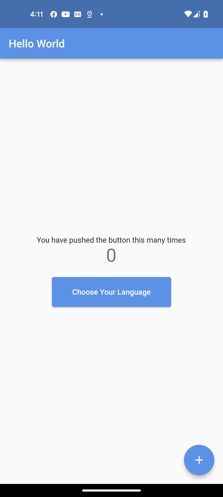
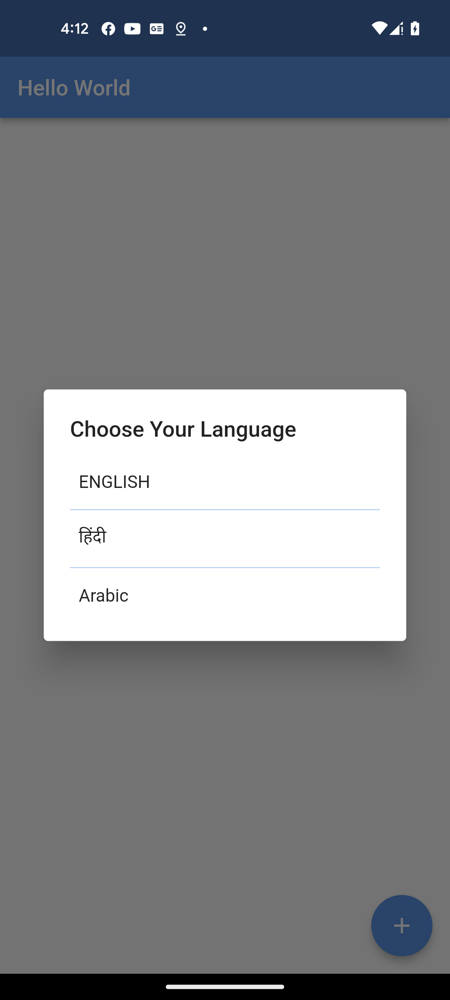
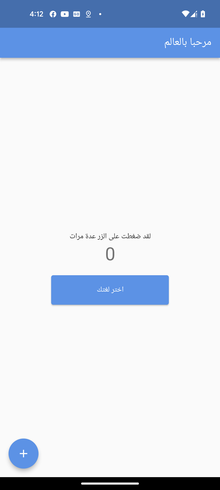

# localization_using_getx

A new Flutter project.

## Getting Started

# Screenshots (Arun Android)

<p align="center">

  
  
  
  
  
  
</p>


# Dependencies

```
  get: ^4.6.5
     
     
  class LocaleString extends Translations {
  @override
  Map<String, Map<String, String>> get keys => {
        'en_US': {
          'hello': 'Hello World',
          'hint_text': 'You have pushed the button this many times',
          'change_language': 'Choose Your Language',
          'increment': 'Increment'
        },
        'hi_IN': {
          'hello': 'नमस्ते दुनिया',
          'hint_text': 'आपने कई बार यह बटन दबाया है',
          'change_language': 'अपनी भाषा चुनिए',
          'increment': 'वृद्धि'
        },
        'ar_SA': {
          'hello': 'مرحبا بالعالم',
          'hint_text': 'لقد ضغطت على الزر عدة مرات',
          'change_language': 'اختر لغتك',
          'increment': 'زيادة راتب'
        }
      };
      
  }
  

```

# main.dart

```
 @override
  Widget build(BuildContext context) {
    return GetMaterialApp(
      debugShowCheckedModeBanner: false,
      translations: LocaleString(),
      locale: const Locale('en', 'US'),
      theme: ThemeData(
        primarySwatch: Colors.blue,
      ),
      home: const MyHomePage(),
    );
  }

```
